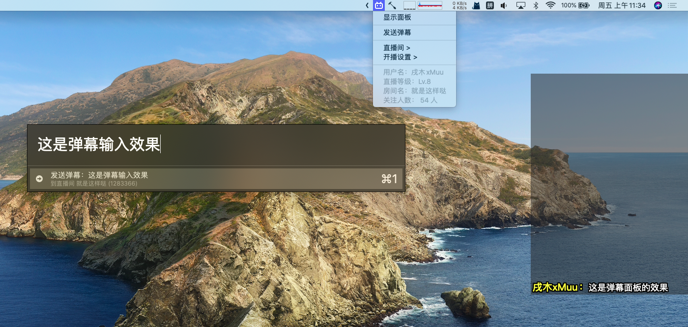

# bililive-helper

一个用于 Bilibili 直播的 Hammerspoon 小工具。
目前实现的功能有：
- 显示房间信息
- 快速打开直播间和直播设置页面
- 显示弹幕悬浮窗
- 快捷键发送弹幕

弹幕悬浮窗使用的是 [bilibili-live-chat](https://github.com/Tsuk1ko/bilibili-live-chat) ，很好用的一个工具！快去 Star ！


## 截图展示




## 使用方法

0. 安装 [Hammerspoon](https://www.hammerspoon.org)
1. `git clone https://github.com/xMuu/bililive-helper.git ~/.hammerspoon/bililive` 将项目克隆到本地 Hammerspoon 目录下
2. 将 `config.example.lua` 重命名为 `config.lua` 并填写好相关信息，具体配置说明请看下一部分
3. 在 `init.lua` 中添加 `require "bililive.helper"` 调用工具
4. 重载 Hammerspoon 配置（在菜单栏点击 Reload Config）


## 配置说明

```
-- 房间信息 -- 
roomID = "" -- 房间ID
-- 直播间网址后面的数字，例如 https://live.bilibili.com/1283366 则填写 1283366
refreshTime = 600 -- 菜单中房间信息的刷新时间，单位：秒

-- 用户个人信息 --
-- 用于发送弹幕，如果不需要弹幕可以留空
userRND = "" -- 用户 RND
userCookie = "" -- 用户 Cookie
userCSRF = "" -- CSRF Token
-- 浏览器登陆到直播间，打开发者工具的 Network 网络面板，手动发送一条弹幕，在 send 请求中获取相关信息填入即可

-- 弹幕面板相关 --
viewXPoint = 1600 -- 弹幕面板横坐标
viewYPoint = 150 -- 弹幕面板纵坐标
viewWidth = 320 -- 弹幕面板宽度
viewHeight = 450 -- 弹幕面板高度
showAvatar = "false" -- 是否显示头像，"true" 为显示，"false" 为不显示，不可以去掉双引号！
danmakuOrder = "bottom" -- 弹幕显示顺序， "top" 为自上向下显示，"bottom" 为自下向上显示
danmakuStayTime = 20 -- 弹幕停留时间，单位：秒
danmakuSpeed = 1000 -- 弹幕显示速度，单位：条/秒，超过的弹幕会随机忽略
showGiftCombine = 1000 -- 弹幕合并时间，单位：毫秒
```


## 快捷键

- `cmd` + `ctrl` + `-` -> 打开弹幕发送面板
- `cmd` + `ctrl` + `+` -> 显示\隐藏弹幕悬浮窗

> 如需修改，请查阅 Hammerspoon 文档并修改位于 `sender.lua` 和 `viewer.lua` 的快捷键绑定代码。


## 其他说明

本项目为个人爱好的产出成果，部分内容间接或直接来源于互联网，如有侵权请及时联系，将第一时间移除。